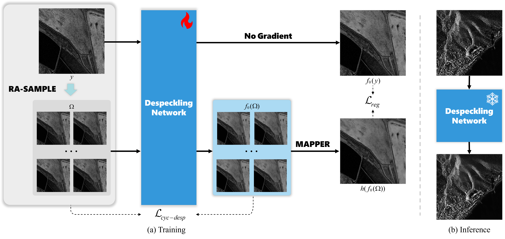

# Self-supervised Despeckling Based Solely on SAR Intensity Images: A General Strategy

Official repository for **Self-supervised Despeckling Based Solely on SAR Intensity Images: A General Strategy**.

SDS-SAR provides a general self-supervised despeckling strategy for SAR intensity images. It is designed to train despeckling networks using only speckled SAR intensity images, without requiring speckle-free references, multi-temporal stacks, SLC data, or additional modality assumptions.

> Dataset and pretrained model links are provided below. The code will be updated progressively.

<p align="center">
  
</p>

## News

- **2026.01**: Paper published in *ISPRS Journal of Photogrammetry and Remote Sensing*.

## Paper

**Self-supervised despeckling based solely on SAR intensity images: A general strategy**  
Liang Chen, Yifei Yin, Hao Shi, Jingfei He, Wei Li  
*ISPRS Journal of Photogrammetry and Remote Sensing*, vol. 231, pp. 854--873, 2026.  
DOI: [10.1016/j.isprsjprs.2025.11.025](https://doi.org/10.1016/j.isprsjprs.2025.11.025)

## Highlights

- A self-supervised despeckling strategy based solely on SAR intensity images.
- A theoretical criterion for training without speckle-free SAR references.
- Random-Aware sub-SAMpler with Projection correLation Estimation (**RA-SAMPLE**) for constructing mutually independent training pairs.
- A multi-feature loss combining despeckling, regularization, and perceptual terms.
- Applicable to diverse SAR intensity images and multiplicative coherent imaging noise.

## Repository Structure

```text
SDS-SAR/
├── assets/                  # Figures used in README
├── configs/                 # Configuration files
├── scripts/                 # Utility scripts
├── src/                     # Source code
├── README.md
└── requirements.txt
```

## Installation

```bash
git clone https://github.com/YYF121/SDS-SAR.git
cd SDS-SAR

conda create -n sds-sar python=3.7 -y
conda activate sds-sar

pip install -r requirements.txt
```

## Pretrained Model

The SDS-SAR pretrained weight is available as `sds-sar.pth`:

- Baidu Netdisk: [sds-sar.pth](https://pan.baidu.com/s/1SZOxAdGpFBAvmWw5OnK6tA?pwd=u754)
- Extraction code: `u754`

## Dataset

The SDS-SAR despeckling dataset is available as `SDS_despeckle.rar`:

- Baidu Netdisk: [SDS_despeckle.rar](https://pan.baidu.com/s/1qImK4qk4SusJ9H_cOfW_Og?pwd=2vsu)
- Extraction code: `2vsu`

## Citation

If this work is useful for your research, please cite:

```bibtex
@article{chen2026self,
  title={Self-supervised despeckling based solely on SAR intensity images: A general strategy},
  author={Chen, Liang and Yin, Yifei and Shi, Hao and He, Jingfei and Li, Wei},
  journal={ISPRS Journal of Photogrammetry and Remote Sensing},
  volume={231},
  pages={854--873},
  year={2026},
  publisher={Elsevier}
}
```

## Contact

For questions, please contact:

- Yifei Yin: 513843129@qq.com

## Acknowledgement

This repository is built for the SDS-SAR paper. We thank the SAR image despeckling and self-supervised learning communities for their valuable research foundations.

